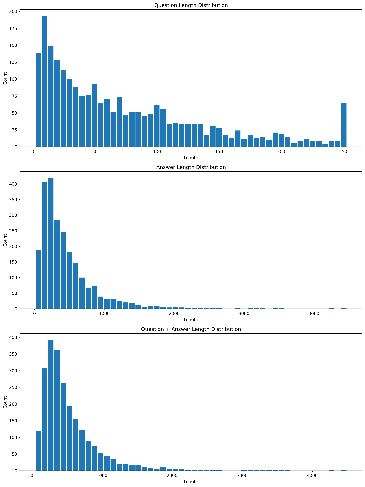

# Cataloging Forum Question Retrieval

This repository contains experiments for improving question retrieval for the Cataloging Forum dataset using embedding-based semantic search and BM25-based lexical retrieval.

The project compares semantic retrieval based on multilingual E5 embeddings with lexical retrieval based on BM25, and explores whether combining both methods can improve retrieval coverage.

## Project Overview

Question retrieval often faces two types of matching problems:

1. **Semantic mismatch**  
   A user may ask a question using different wording from the original reference question.

2. **Keyword mismatch**  
   Some relevant answers may contain important terms that are not obvious from the question title alone.

To address these issues, this project evaluates a hybrid retrieval pipeline that combines:

- Embedding-based semantic retrieval
- BM25 keyword-based retrieval
- Candidate comparison between the two methods

## Dataset

The reference dataset contains cleaned question-answer pairs from the Cataloging Forum FAQ collection.

The expected columns include:

```text
主旨
答覆內容
```

where:

- `主旨` is used as the reference question field.
- `答覆內容` is used as the answer field.

## Dataset Length Distribution

Before conducting retrieval experiments, the length distributions of questions, answers, and combined question-answer pairs were analyzed.




## Retrieval Methods

### Hybrid Retrieval

The hybrid retrieval experiment retrieves candidates from both:

```text
embedding_top50
bm25_top50
```

### Embedding Retrieval

The semantic retrieval method uses:

```text
intfloat/multilingual-e5-large
```

Each reference question is encoded into an embedding vector. During retrieval, the input query is also encoded, and cosine similarity is used to retrieve the most similar reference questions.

### BM25 Retrieval

The lexical retrieval method uses BM25 to retrieve candidates based on keyword matching over the  `答覆內容` field.

Chinese text is processed using CKIP word segmentation. The experiment compares different token filtering strategies, including POS filtering and stopword removal.

## Requirements

This project requires Python 3.10 or above.

Install the required packages with:

```bash
pip install -r requirements.txt
```

## How to Run

### 1. Generate Embeddings

The precomputed embedding file is included in this repository. If needed, users can regenerate it from the cleaned reference QA dataset using the following command:

```bash
python3 scripts/export_cleanqa_embeddings.py \
  --input-csv data/reference_qa_clean.csv \
  --output-csv embeddings/qa_embeddings.pkl \
  --mode question \
  --normalize
```

This command reads the cleaned QA dataset and creates:

```text
embeddings/qa_embeddings.pkl
```

The default embedding model is:

```text
intfloat/multilingual-e5-large
```

### 2. Run Hybrid Retrieval

The retrieval script performs both embedding retrieval and BM25 retrieval. It outputs the top candidates from each method into a JSON file.

To disable CKIP POS filtering for BM25 retrieval, use:

```bash
python3 scripts/candidate.py \
  --reference-csv data/reference_qa_clean.csv \
  --index-path embeddings/qa_embeddings.pkl \
  --input-csv data/test_questions.csv \
  --output-json results/dist_result_no_pos.json \
  --top-k 50 \
  --no-pos-filter
```

This mode keeps more segmented tokens and may improve recall for some keyword-based queries.

### 4. Convert JSON Results to CSV

To convert the JSON retrieval results into CSV format:

```bash
python3 scripts/json_to_csv.py
```

The converted CSV file can be used for further analysis and ranking comparison.


